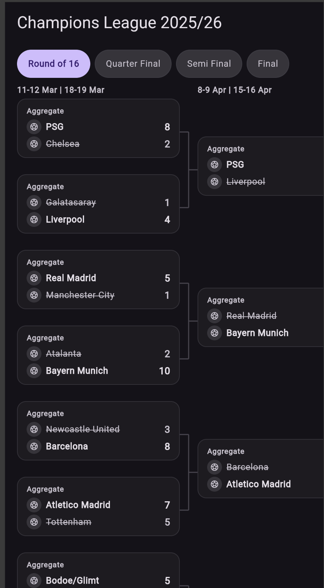
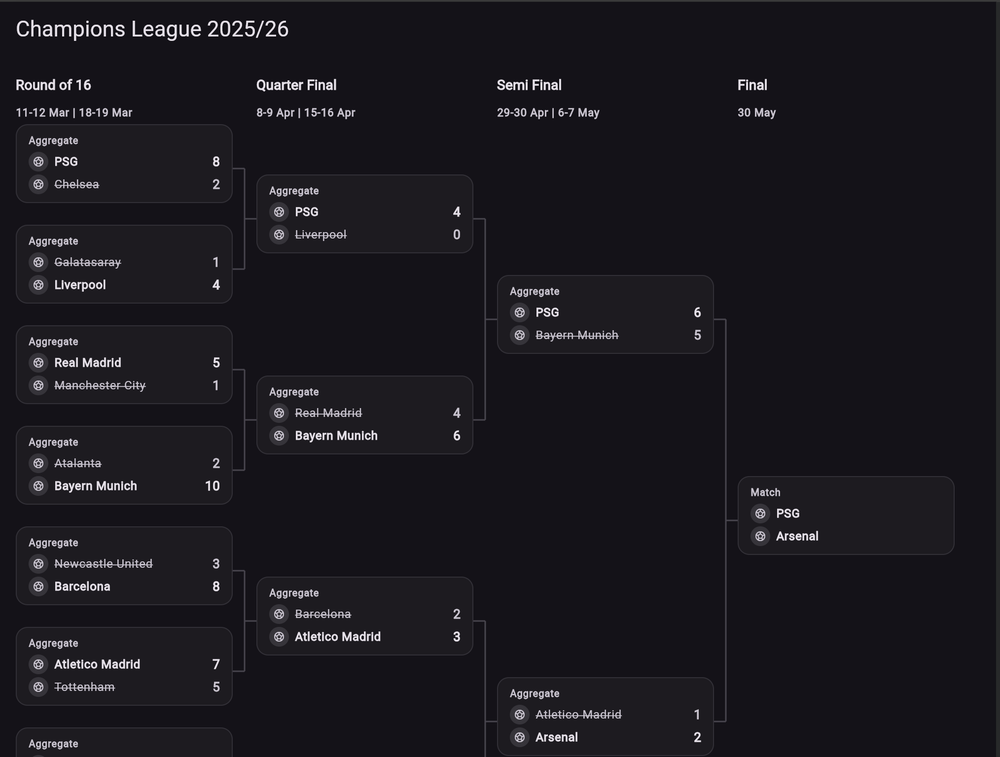
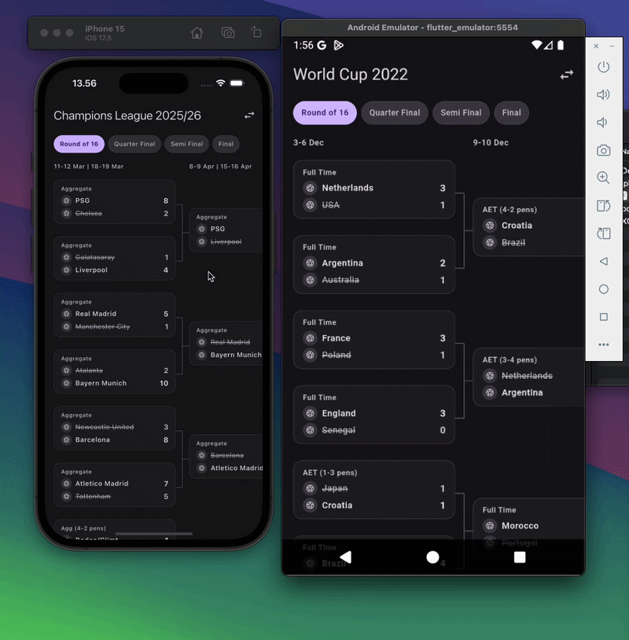

# bracket_view

A reusable Flutter tournament bracket widget with scroll-driven animations and responsive layout.

[](https://pub.dev/packages/bracket_view)

## Screenshots

| Mobile (Scroll + Snap) | Desktop (Full Bracket) |
|---|---|
|  |  |

## Demo



## Features

- 🏆 Horizontal scroll bracket with snap-to-round behavior
- 🎬 Scroll-driven card position animation (bracket-aligned ↔ compact)
- 🔗 Connector lines between rounds (Type A fixed + Type B animated)
- 📱 Responsive: scroll mode on mobile, full bracket on desktop
- 🎨 Round chip selector with auto-scroll (mobile only)
- 🖌️ Customizable theme (colors, sizes, animation curves)
- 🧩 Custom card builder and team image builder support
- 📦 Generic models — zero external dependencies
- 🌐 Web support with drag-to-scroll

## Installation

```yaml
dependencies:
  bracket_view:
    git:
      url: https://github.com/oohyugi/bracket-view.git
```

## Usage

```dart
import 'package:bracket_view/bracket_view.dart';

BracketView(
  rounds: [
    BracketRound(
      id: 'qf',
      name: 'Quarter Final',
      dateLabel: '8-9 Apr | 15-16 Apr',
      matches: [
        BracketMatch(
          id: '1',
          teamA: BracketTeam(name: 'PSG', imageUrl: '...'),
          teamB: BracketTeam(name: 'Liverpool', imageUrl: '...'),
          scoreA: 4,
          scoreB: 0,
          status: BracketMatchStatus.finished,
          winnerSide: 'A',
          label: 'Aggregate',
        ),
        // ...more matches
      ],
    ),
    // ...more rounds
  ],
  onRoundChanged: (index) => print('Active round: $index'),
  onMatchTap: (match) => print('Tapped: ${match.id}'),
  teamImageBuilder: (context, url, size) => MyTeamLogo(url: url, size: size),
  theme: BracketTheme(
    columnWidth: 220,
    columnGap: 24,
    cardHeight: 90,
  ),
)
```

## Customization

### Theme

```dart
BracketTheme(
  columnWidth: 220.0,       // Width of each round column
  columnGap: 24.0,          // Gap between columns (connector area)
  cardHeight: 90.0,         // Estimated card height for positioning
  compactGap: 12.0,         // Gap between cards when snapped
  connectorColor: Colors.grey,
  connectorWidth: 1.5,
  chipSelectedColor: Colors.blue,
  chipUnselectedColor: Colors.grey[800],
  snapDuration: Duration(milliseconds: 250),
  snapCurve: Curves.easeOutCubic,
)
```

### Custom Match Card

```dart
BracketView(
  rounds: rounds,
  matchCardBuilder: (context, match) {
    return MyCustomCard(
      teamA: match.teamA.name,
      teamB: match.teamB.name,
      scoreA: match.scoreA,
      scoreB: match.scoreB,
    );
  },
)
```

### Custom Team Image

```dart
BracketView(
  rounds: rounds,
  teamImageBuilder: (context, imageUrl, size) {
    return CachedNetworkImage(
      imageUrl: imageUrl ?? '',
      width: size,
      height: size,
    );
  },
)
```

## Animation Behavior

### Mobile (Small Screen)
- **Scroll right:** Next round cards animate from bracket-aligned (centered between parent pairs) to compact (stacked from top)
- **Snap:** Columns snap to nearest position on finger release
- **Freeze:** Snapped columns stay compact — no re-animation on continued forward scroll
- **Scroll left:** Frozen columns unfreeze and animate back to bracket-aligned

### Desktop (Large Screen)
- All rounds visible at once with round name headers
- Cards in bracket-aligned positions (proper tree layout)
- Horizontal scroll available if content exceeds viewport
- No snap behavior

### Connectors
- **Type A (right side):** Fixed to parent column — stays in place during animation
- **Type B (left side):** Moves with animated cards — creates natural "disconnect" effect during transitions

## Models

| Model | Description |
|---|---|
| `BracketRound` | A round with name, matches, and optional date label |
| `BracketMatch` | A match with two teams, scores, status, and winner |
| `BracketTeam` | A team with name and optional image URL |
| `BracketTheme` | Visual configuration for the bracket |

## Running the Example

```bash
cd example
flutter run -d chrome
```

## License

MIT
